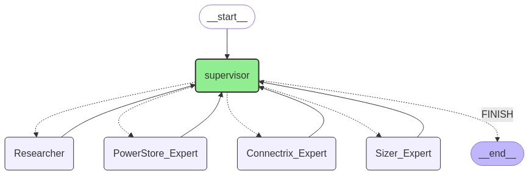

# LLM Agents

## Summary
This application was created for users to better understand how LLMs can utilise agents and tools to better assist users in accomplishing complicated tasks. 

Building on its core multi-agent architecture, this advanced chat interface transforms how users interact with vector store information. While the supervisor agent efficiently routes queries to specialized experts, users can watch the decision-making process through a dynamic workflow visualization. 

The system excels at providing comprehensive answers about storage solutions, switch configurations, and hardware sizing recommendations. With an intuitive interface and example queries, the application makes complex technical information accessible while maintaining complete transparency about which expert is handling each part of the conversation.

---

This diagram illustrates a multi-agent system architecture with a hierarchical control flow.
- Supervisor: The central coordinator delegating tasks and consolidating results, similar to a project manager.
- Specialized Agents: Possess domain-specific knowledge for handling specialized tasks, like subject matter experts.
- Task Delegation: The supervisor assigns tasks to the appropriate specialized agents.
- Result Aggregation: The supervisor gathers results from each agent to provide a final output.
- This approach allows for breaking down complex tasks and leveraging the strengths of individual agents for effective problem-solving.

---

# Replicating this demo
## 1. Clone this repository

## 2. Create a .env file with the help of the .env.template file

## 3. Build docker image
    
    docker pull vllm/vllm-openai:latest
    docker build -f Dockerfile -t your-registry/image-name:version .

## 4. Start the vLLM-powered inference API

    docker run --gpus "device=0" --cpus="16" --memory="16g" --shm-size="8gb" \
        --env-file ${pwd}/.env \
        -v ${pwd}:/nfs \
        -p 8001:8001 -it --rm --name app-name \
        vllm/vllm-openai:latest \
        python -m vllm.entrypoints.openai.api_server --host "0.0.0.0" --port "8001" \
        --gpu-memory-utilization 0.5 --model ${pwd}/your-model \

## 5. Start the Gradio frontend
    docker run --cpus="8" --memory="16g" --gpus "device=1" \
        -v ${pwd}:/nfs -p 7860:7860 -it --rm --name app-name \
        --env-file .env \
        your-registry/image-name:version
